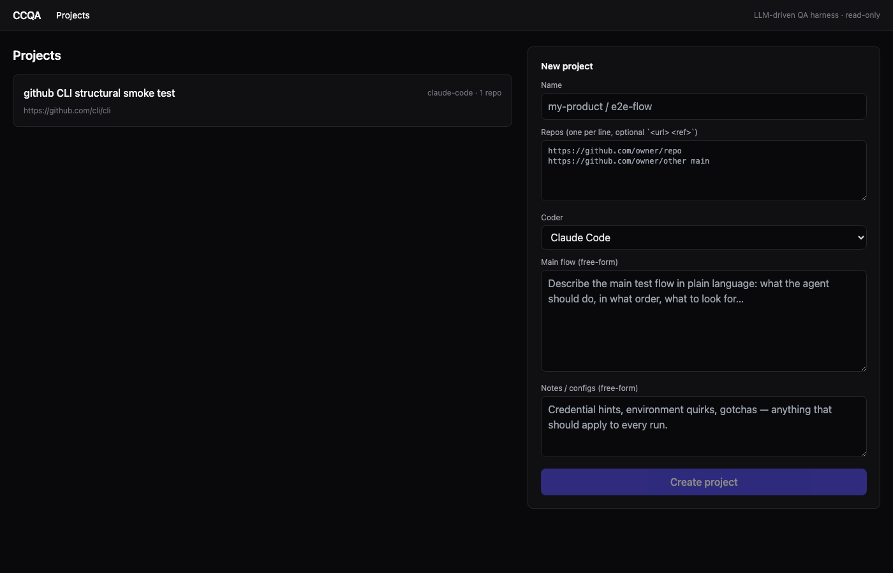
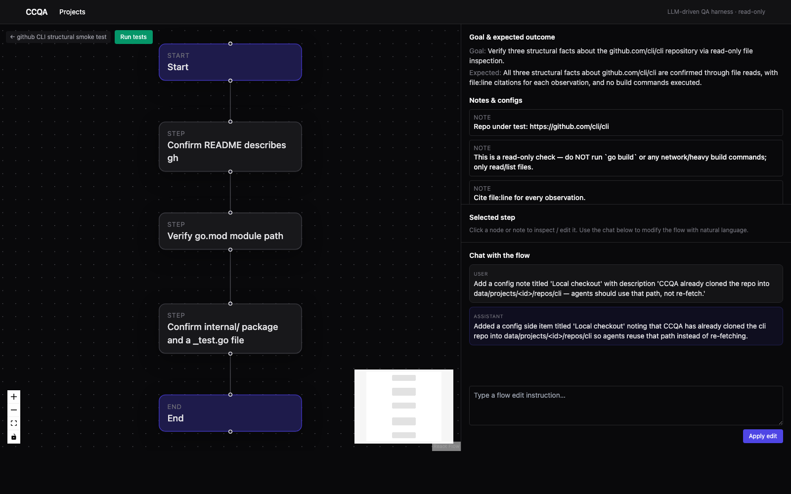
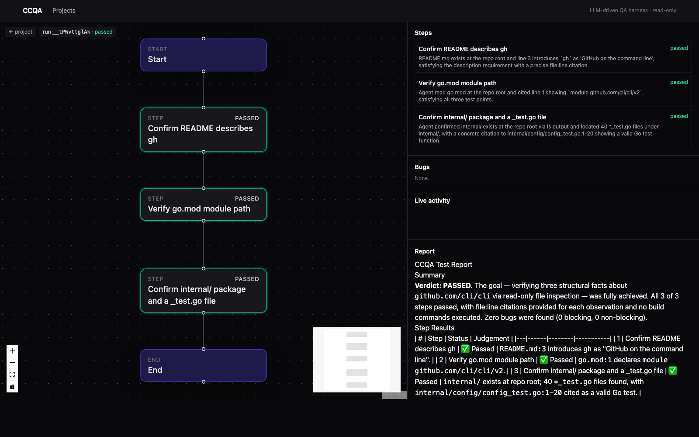

# CCQA — LLM 驱动的 QA 测试系统

[](https://www.npmjs.com/package/@ccqa/cli)
[](LICENSE)


[English](README.md) · 中文

一个独立的工具：用一段自然语言描述你想怎么测，CCQA 调度
**Claude Code** / **Codex** / Kimi 这样的 AI coder 帮你跑测试，就像把一张
便利贴交给一个测试工程师那样。你只需要建一次项目（名字、几个 git 仓库、
一段大白话写的测试流程），CCQA 会把它转成一个有节点和成功标准的结构化
流程图，然后 coder agent 一边只读地翻代码，一边走流程，一边由另一个
LLM 给每一步打分，发现问题就记录 bug。跑完给你出一份 markdown 报告。

整个系统是**只读**的 —— agent 可以 grep 仓库、跑 lint、curl 接口、ssh
跳板机，但绝不会 `Write`、`Edit` 或者提交代码。

> **状态：alpha。** 本地端到端冒烟测试通过（建项目 → 生成流程 → 通过
> 对话改流程 → 跑测试 → 中断 → 出报告）。还没有自动化测试套件。
> 期望有粗糙的边角 —— 欢迎 issue 和 PR。

## 截图

**1. 建项目** — 粘上 git 仓库地址、选 coder、用大白话写测试流程。



**2. 流程设计器** — LLM 把你的描述转成结构化流程。可以拖动节点、就地编辑，
也可以跟流程对话（"把第 2 步拆成两步"、"加个关于 ANTHROPIC_API_KEY 的
配置说明"）。不在主流程里的注意事项 / 配置走右侧列表。



**3. 实时跑测** — coder 跑到哪个节点哪个就亮起来。右边面板实时显示
agent 的文本 / 工具调用 / judge 判定，跑完最终的 markdown 报告也在那儿。



## 仓库结构

| 包 | 作用 |
| --- | --- |
| [shared/](shared/) | 跨包共享的类型（Project / Flow / Run / Bug / Event）。 |
| [server/](server/) | Fastify + SQLite，负责 HTTP API、跑 executor、通过 WebSocket 推事件。 |
| [web/](web/) | React + ReactFlow，包含项目设置页、流程画板、实时跑测页、对话式流程编辑。 |
| [cli/](cli/) | `ccqa` CLI，给无头工作流用。 |
| [data/](data/) | SQLite + 克隆的仓库 + 测试流水。已加 gitignore。 |

## 环境要求

- Node ≥ 20
- `claude` CLI 已登录（[Claude Agent SDK](https://github.com/anthropics/claude-agent-sdk-typescript) 复用同一份 OAuth）
- `git` 在 `$PATH` 里
- 可选：`codex` CLI 已登录（如果想用 Codex coder）
- 可选：`ANTHROPIC_API_KEY` —— 监督 LLM 调用（生成 / 编辑 / 评判 / 报告）会优先走它；不设置就回退到 `claude -p`，复用 claude 已经登录的鉴权。

## 快速开始（npm 安装）

发布的包是 `@ccqa/cli`。一条命令装好，自带 server 和打包好的 web UI：

```bash
npm install -g @ccqa/cli
ccqa serve              # 起 http://127.0.0.1:4317，自动开浏览器
# 另开一个终端，或直接在 UI 里操作：
ccqa project new --name demo --repo https://github.com/owner/repo --flow-file flow.txt
ccqa run start <projectId>
```

数据（SQLite、克隆的仓库、跑测流水）放在你运行 `ccqa serve` 的目录下的
`./.ccqa/` 里。想换位置设 `CCQA_DATA_DIR`。

## 从源码运行

```bash
git clone https://github.com/yzlee/ccqa
cd ccqa
npm install
cp .env.example .env  # 把 ANTHROPIC_API_KEY 填上（可选）
```

最小 `.env`（项目根目录）：

```bash
ANTHROPIC_API_KEY=sk-ant-...
# CCQA_PORT=4317
# CCQA_HOST=127.0.0.1
# CCQA_DEFAULT_CODER=claude-code   # claude-code | codex | kimi
# CCQA_JUDGE_MODEL=claude-sonnet-4-6
# CCQA_CODEX_CLI=codex
```

两个终端：

```bash
# 1) 后端  (端口 4317)
npm run dev:server

# 2) Web UI  (端口 4318)
npm run dev:web
```

浏览器开 <http://127.0.0.1:4318>。或者直接走 CLI：

```bash
npm run cli -- health
npm run cli -- project new \
  --name "rey-early" \
  --coder claude-code \
  --repo https://github.com/your-org/your-repo \
  --flow-file ./flow.txt \
  --notes "凭据在 1Password / aws --profile early"
npm run cli -- project clone <id>
npm run cli -- flow generate <id>
npm run cli -- run start <id>           # 实时把事件流到终端
```

## 它怎么工作

```
┌─────────┐   "主流程文本"          ┌─────────────────┐
│  user   │ ─────────────────────▶ │  flow generator │  (LLM)
└─────────┘                        └────────┬────────┘
                                            ▼
              ┌─────────── 结构化 Flow（节点 / 边 / 注意事项）─────────┐
              │   ┌────────┐  ┌────────┐  ┌────────┐  ┌────────┐        │
              │   │ start  ├─▶│ step 1 ├─▶│ step 2 ├─▶│  end   │        │
              │   └────────┘  └────────┘  └────────┘  └────────┘        │
              │                                                         │
              │  off-flow notes / configs（右侧列表）                   │
              └─────────────────────────────────────────────────────────┘
                                            │
                                  ┌─────────┴──────────┐
                                  │   flow executor    │
                                  └─────────┬──────────┘
                                            ▼
              ┌─────────────────────────────────────────────────────────┐
              │  对每一步：                                             │
              │   1. coder.run({ cwd, prompt: step, read-only })        │
              │      Claude Code / Codex 流式产出 text + 工具调用。     │
              │   2. judge LLM 读 transcript → pass/fail + bugs。       │
              │   3. blocking bug? → 提前停。否则继续。                 │
              └─────────────────────────────────────────────────────────┘
                                            │
                                            ▼
                            report writer LLM → markdown
```

### 流程生成
[server/src/flow/generate.ts](server/src/flow/generate.ts) —— 把用户的自由文本 +
项目仓库交给 LLM，要求返回 `{overall_goal, expected_outcome, steps[], notes[]}`。
steps 变成画板节点，notes 进右侧列表。

### 通过对话改流程
[server/src/flow/edit.ts](server/src/flow/edit.ts) —— 用户输入"把第 3 步拆成两步"
或"加个关于 ANTHROPIC_API_KEY 的配置说明"，把当前 flow JSON + 指令丢给 LLM，
它返回**完整的**新 flow + 一句给聊天面板的总结。

### Coder 适配器
[server/src/coders/](server/src/coders/) 用统一的 `Coder` 接口包每种 agent，
吐 `CoderEvent`、返回最终 summary。只读靠 `disallowedTools = ["Write", "Edit",
"NotebookEdit"]`（Claude Code）和 `--sandbox read-only`（Codex）来强制；
system prompt 也再次重申。

### Judge
[server/src/flow/judge.ts](server/src/flow/judge.ts) —— 每个 step 跑完后，
agent 的 transcript + 该步的 success criteria 交给 judge LLM。它返回
`{passed, status, reason, bugs[]}`。每个 bug 的 severity 和 `blocking` 都是
LLM 决定的 —— non-blocking bug 记录下来继续跑，blocking 直接停。

### 实时 UI
流程画板用 React Flow。每个节点监听该 run 的 `step.started` / `step.finished`
WebSocket 事件（[web/src/pages/Run.tsx](web/src/pages/Run.tsx)）。右侧面板实时
流 agent 的 text / tool_use / tool_result，所以你能看到 agent **当前在看什么**。
跑完之后 markdown 报告显示在活动日志下面。

### 主流程文本示例

这个系统就是奔着你那种"贴进 Cursor 对话框的长 prompt"做的 —— 一段大白话，
带前置条件、边界情况、避坑提示。把同样的文本丢进**主流程文本**框点
**生成流程**，LLM 会：

- 把环境前置（ssh 凭据、AWS 切账号、archive-delete 前置等）抽到"config"
  注意事项里
- 每个逻辑阶段一个 step 节点（"清理旧 hi 安装"、"通过 openclaw 装 hi"、
  "注册 6 个用户"、"互发 listing"、"验证 zoom 链接是真的而不是 LLM 编的"、
  "压测"…）
- 你写的"重点测的核心点"塞进对应节点的 `testPoints`
- 你写的成功语言塞进 `successCriteria`

然后点**一键测试**，看每个节点亮起来。

## 注意事项 / 已知限制

- **分支：** executor 默认按拓扑序走。一个节点有多个出边时，会让 judge LLM
  根据刚跑完的 transcript 选支路。循环还不是一等公民 —— 想重试就让 step
  描述里直接说"重复 N 次"。
- **取消：** Web 上的 **Stop** 按钮和 CLI 的 `ccqa run cancel` 通过
  `AbortController` 中断 coder 当前轮。即使中断，judge 仍然会基于部分
  transcript 给出判定，所以上下文不会丢。
- **重跑：** run 是不可变的。要重跑，去项目页面点 Run。
- **成本：** 每个 step 的开销 = (a) coder 调研用的 token + (b) 一次 judge LLM
  调用。最后报告再算一次。如果 SDK 报告了用量，会出现在 run 的 `usage` 字段里。

## 加新 coder

在 [server/src/coders/](server/src/coders/) 实现 `Coder` 接口（参考
[claudeCode.ts](server/src/coders/claudeCode.ts) 或
[codex.ts](server/src/coders/codex.ts) 模板），在
[index.ts](server/src/coders/index.ts) 注册，然后给 web 的项目表单和 CLI 的
`--coder` 加上选项。executor 不关心你用哪个 coder —— 它只消费事件流。

## 贡献

详见 [CONTRIBUTING.md](CONTRIBUTING.md)：本地开发、各包的目录布局、
加 adapter 和调监督 prompt 的约定。

## License

[MIT](LICENSE)
